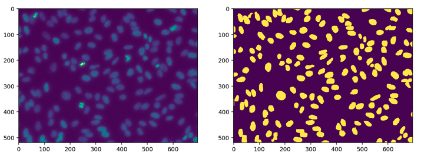
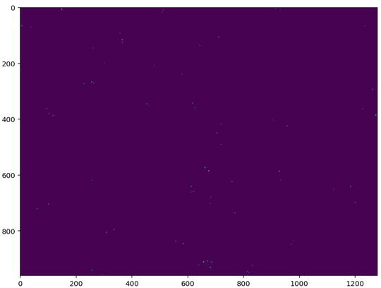
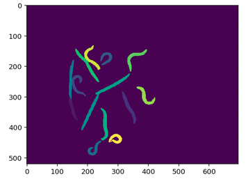

# Basic Image Analysis with Python

This repository contains fundamental techniques and examples for image analysis, with a focus on bioimaging applications. These methods were originally developed during a course I took on image analysis and include practical tools and concepts commonly used in the field.

## Features
- **Basic Techniques**:
  - Image segmentation

  - Spot detection
  

  - sklearn
    

  - Image alignment
    

- **Libraries Used**:
  - [scikit-learn](https://scikit-learn.org/)
  - [OpenCV](https://opencv.org/)
  - [scikit-image](https://scikit-image.org/)

## Applications
These techniques are particularly useful for processing biological images, such as analyzing cell images, detecting objects of interest, and performing basic image transformations.

If you are interested in more advanced image analysis methods, check out my other repository:
[Axon-extraction](https://github.com/Dewey-Wang/Axon-extraction).

## License
This repository is released under the MIT License. See [LICENSE](./LICENSE) for details.

## Acknowledgments
This repository is based on coursework and examples learned during a course on image analysis. Special thanks to the instructors and colleagues for their guidance and inspiration.

